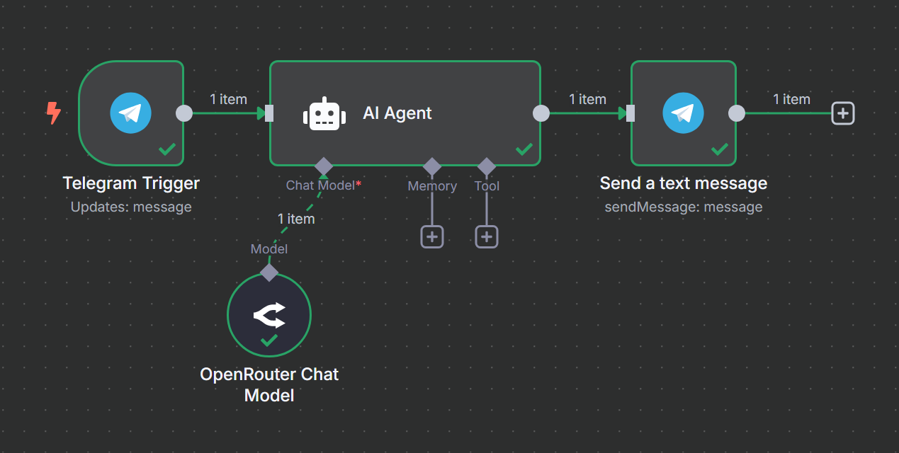

# Telegram Task-Splitter Bot

Ein kompaktes **No-Code/Low-Code-Projekt** mit n8n, das Telegram-Nachrichten per Webhook entgegennimmt, in Teilaufgaben zerlegt und die Ergebnisse zurück in den Chat sendet.

---

## 🚀 Features

- Telegram-Integration über Webhook  
- AI-gestützte Aufgabenteilung (OpenRouter Chat Model)  
- No-Code-Workflow in n8n konfiguriert  
- Einfache Wiederverwendbarkeit via JSON-Export  

---

## 🛠 Tech-Stack

- n8n (Workflow-Orchestrator)  
- Docker & Docker Compose  
- ngrok (kostenloser HTTPS-Tunnel)  
- OpenRouter Chat Model  
- Telegram Bot API  

---

## ⏱ Setup & Quickstart

```bash
# 1. ngrok-Tunnel starten und URL merken  
ngrok http 5678

# 2. docker-compose.yml anpassen  
#    environment:
#      - N8N_PROTOCOL=https
#      - WEBHOOK_URL=https://<deine-ngrok-url>.ngrok-free.app
#      - N8N_EDITOR_BASE_URL=https://<deine-ngrok-url>.ngrok-free.app

# 3. Container starten  
docker compose up -d

# 4. Workflow importieren  
#    http://localhost:5678 → Import → splitBot_n8n_workflow.json → Active

# 5. Bot im Chat aktivieren  
#    /start an deinen Bot senden  
#    Split: Projektplan erstellen
```
## Screenshot des Workflows

